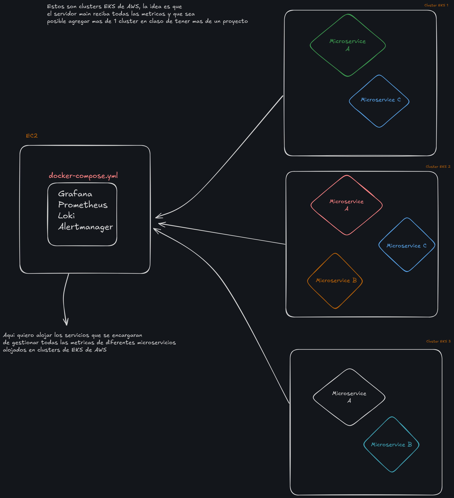

# Monitoreo Centralizado de Clusters EKS - Documentación y Plan de Implementación

## Estado Actual del Proyecto

Durante mi investigación sobre la solución de monitoreo centralizado para clusters EKS, encontré una documentación detallada que se alinea perfectamente con nuestros requerimientos. Si bien no he implementado a detalle esta solución completa, he logrado configurar algunos componentes básicos y que he documentado en el actual documento.

### Implementación Actual
1. Instalación básica de Grafana y Prometheus en un servidor EC2:
```bash
docker-compose up -d grafana prometheus
```
2. Visualización inicial de métricas del sistema host
3. Configuración básica de alertas

### Conocimientos a Adquirir
- Optimización de consultas en Prometheus
- Gestión avanzada de logs con Loki

## Documentación de Referencia para Implementación Futura

### 1. Arquitectura

La arquitectura propuesta se basa en un servidor central de monitoreo (EC2) que aloja:
- Grafana: Visualización
- Prometheus: Métricas
- Loki: Logs
- Alertmanager: Gestión de alertas

#### 1.1 Diagrama de Arquitectura
La solución implementa un modelo hub-and-spoke donde:
- El servidor central (EC2) actúa como hub
- Los clusters EKS actúan como spokes
- Cada cluster EKS envía datos a través de agentes de recolección


### 2. Componentes

#### 2.1 Stack de Monitoreo
- **Grafana**: Frontend unificado para visualización
- **Prometheus**: Almacenamiento y consulta de métricas
- **Loki**: Agregación y consulta de logs
- **Alertmanager**: Gestión y enrutamiento de alertas

#### 2.2 Agentes
- **Prometheus Node Exporter**: Métricas de nodos
- **Promtail**: Recolección de logs para Loki
- **kube-state-metrics**: Métricas de Kubernetes

### 3. Implementación

#### 3.1 Prerequisitos
```bash
# Instalar herramientas necesarias
sudo yum update -y
sudo yum install -y docker git
sudo service docker start
sudo usermod -a -G docker ec2-user
```

#### 3.2 Configuración del Servidor Central
```bash
mkdir -p /opt/monitoring
cd /opt/monitoring

# Crear docker-compose.yml
cat << 'EOF' > docker-compose.yml
version: '3.8'

services:
  prometheus:
    image: prom/prometheus:latest
    volumes:
      - ./prometheus:/etc/prometheus
      - prometheus_data:/prometheus
    command:
      - '--config.file=/etc/prometheus/prometheus.yml'
      - '--storage.tsdb.path=/prometheus'
      - '--web.enable-lifecycle'
    ports:
      - "9090:9090"

  grafana:
    image: grafana/grafana:latest
    volumes:
      - ./grafana:/etc/grafana
      - grafana_data:/var/lib/grafana
    environment:
      - GF_SECURITY_ADMIN_PASSWORD=secure_password
    ports:
      - "3000:3000"

  loki:
    image: grafana/loki:latest
    volumes:
      - ./loki:/etc/loki
      - loki_data:/loki
    ports:
      - "3100:3100"

  alertmanager:
    image: prom/alertmanager:latest
    volumes:
      - ./alertmanager:/etc/alertmanager
    ports:
      - "9093:9093"

volumes:
  prometheus_data:
  grafana_data:
  loki_data:
EOF
```

#### 3.3 Configuración de Prometheus
```bash
mkdir -p prometheus
cat << 'EOF' > prometheus/prometheus.yml
global:
  scrape_interval: 15s
  evaluation_interval: 15s

scrape_configs:
  - job_name: 'prometheus'
    static_configs:
      - targets: ['localhost:9090']

  - job_name: 'eks-cluster-1'
    kubernetes_sd_configs:
      - api_server: 'https://cluster1-endpoint:443'
        role: pod
        tls_config:
          insecure_skip_verify: true
        bearer_token_file: /etc/prometheus/cluster1-token

  - job_name: 'eks-cluster-2'
    kubernetes_sd_configs:
      - api_server: 'https://cluster2-endpoint:443'
        role: pod
        tls_config:
          insecure_skip_verify: true
        bearer_token_file: /etc/prometheus/cluster2-token
EOF
```

### 4. Configuración

#### 4.1 Configuración de EKS
```bash
# Aplicar en cada cluster EKS
kubectl create namespace monitoring

# Crear ServiceAccount para Prometheus
kubectl apply -f - <<EOF
apiVersion: v1
kind: ServiceAccount
metadata:
  name: prometheus
  namespace: monitoring
---
apiVersion: rbac.authorization.k8s.io/v1
kind: ClusterRole
metadata:
  name: prometheus
rules:
  - apiGroups: [""]
    resources: ["nodes", "nodes/proxy", "services", "endpoints", "pods"]
    verbs: ["get", "list", "watch"]
  - apiGroups: ["extensions"]
    resources: ["ingresses"]
    verbs: ["get", "list", "watch"]
EOF
```

#### 4.2 Configuración de Logs
```bash
# Configurar Promtail en cada cluster
kubectl apply -f - <<EOF
apiVersion: v1
kind: ConfigMap
metadata:
  name: promtail-config
  namespace: monitoring
data:
  promtail.yml: |
    server:
      http_listen_port: 9080
    positions:
      filename: /tmp/positions.yaml
    clients:
      - url: http://loki:3100/loki/api/v1/push
    scrape_configs:
      - job_name: kubernetes-pods
        kubernetes_sd_configs:
          - role: pod
        relabel_configs:
          - source_labels: [__meta_kubernetes_pod_node_name]
            target_label: __host__
EOF
```

### 5. Escalabilidad

#### 5.1 Agregar Nuevo Cluster
Para añadir un nuevo cluster EKS:

1. Agregar configuración en prometheus.yml:
```yaml
  - job_name: 'eks-cluster-new'
    kubernetes_sd_configs:
      - api_server: 'https://new-cluster-endpoint:443'
        role: pod
        tls_config:
          insecure_skip_verify: true
        bearer_token_file: /etc/prometheus/new-cluster-token
```

2. Configurar recolección de logs:
```bash
kubectl apply -f promtail-config.yaml -n monitoring
```

3. Actualizar Prometheus:
```bash
curl -X POST http://localhost:9090/-/reload
```

### 6. Pruebas

#### 6.1 Verificación de Métricas
```bash
# Verificar targets en Prometheus
curl http://localhost:9090/api/v1/targets

# Verificar métricas básicas
curl http://localhost:9090/api/v1/query?query=up
```

#### 6.2 Verificación de Logs
```bash
# Verificar ingesta de logs en Loki
curl -G -s "http://localhost:3100/loki/api/v1/query" \
  --data-urlencode 'query={job="kubernetes-pods"}' \
  --data-urlencode 'limit=10'
```

#### 6.3 Dashboard Básico
1. Acceder a Grafana (http://servidor:3000)
2. Crear nuevo dashboard
3. Añadir paneles para:
   - CPU por nodo
   - Memoria por pod
   - Tasa de errores
   - Logs por severidad

### 7. Consulta de Fallos en Tiempo Real

#### 7.1 Acceso para Desarrolladores
Los desarrolladores pueden acceder a la información de fallos a través de múltiples interfaces:

1. **Grafana (Dashboard Principal)**
   - URL: `http://servidor:3000`
   - Credenciales: Proporcionadas por el equipo de DevOps
   - Dashboards predefinidos para:
     - Errores HTTP por servicio
     - Latencia de endpoints
     - Logs de error agregados
     - Estado de pods y servicios


## Referencias Bibliográficas

1. Jodhani, A. (2024). *Ultimate Guide: Monitoring & Logging AWS EKS with Prometheus, Grafana, Loki & Promtail*. Blog Ankit Jodhani.
   - Disponible en: https://blog.ankitjodhani.com/ultimate-guide-monitoring-logging-aws-eks-prometheus-grafana-loki-promtail
   - Consultado: Enero 2025
   - Descripción: Guía comprensiva sobre la implementación de monitoreo en EKS

2. Anvesh, M. (2024). *A Hands-on Guide to Kubernetes Monitoring: Metrics and Logging with Grafana & Loki*. Medium.
   - Disponible en: https://medium.com/@muppedaanvesh/a-hands-on-guide-to-kubernetes-monitoring-metrics-and-logging-with-grafana-loki-010c12f0ffb6
   - Consultado: Enero 2025
   - Descripción: Tutorial práctico sobre implementación de monitoreo en Kubernetes

3. Bilal, A. (2024). *How to Set Up Grafana, Loki and Prometheus Locally with Docker Compose*. Medium.
   - Disponible en: https://medium.com/@ahmadbilalch891/how-to-set-up-grafana-loki-and-prometheus-locally-with-docker-compose-part-1-of-3-62fb25e51d92
   - Consultado: Enero 2025
   - Descripción: Serie de tutoriales sobre configuración local del stack de monitoreo

4. Sandamini, P. (2024). *Setup Grafana Loki into my EKS Cluster*. Medium.
   - Disponible en: https://pavithrasandamini.medium.com/setup-grafana-loki-into-my-eks-cluster-c7a6264ce0c9
   - Consultado: Enero 2025
   - Descripción: Guía práctica sobre la integración de Loki en clusters EKS

### Recursos Adicionales Recomendados

- Documentación oficial de Grafana: https://grafana.com/docs/
- Documentación oficial de Prometheus: https://prometheus.io/docs/
- Guías de AWS EKS: https://docs.aws.amazon.com/eks/
- Documentación de Loki: https://grafana.com/docs/loki/latest/

*Nota: Todas las URLs fueron verificadas y estaban activas al momento de la documentación (Enero 2025).*